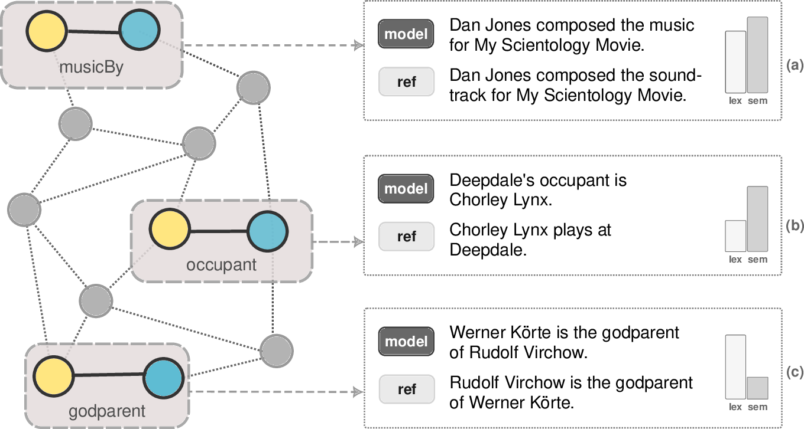

# Generalizing to Unseen Relations in Graph-to-Text Generation

This repository contains code and data for the paper *Generalizing to Unseen Relations in Graph-to-Text Generation*, which is under review for EMNLP 2022.

In this paper, we examine if finetuned BART-base can generate a fluent and semantically accurate verbalizations for a single RDF triple (`<head>`, `<relation>`, `<tail>`), if the `<relation>` was not present in the finetuning corpus.

<p align="left">
  
</p>


## Requirements
The framework uses Python 3, PyTorch Lightning and HuggingFace Transformers. 

See `requirements.txt` for the full list of packages.

Installing the requirements:
```
pip install -r requirements.txt
```

*Note that we use a slighly customized version of GEM-metrics which is included in the repository. If you do not wish to use the GEM-metrics, you may remove the line `-e ./utils/GEM-metrics[heavy]` from `requirements.txt`.*


## Data
The raw **Rel2Text** dataset contains 7,334 RDF triples
(1,716 unique relations) from Wikidata, DBPedia, and YAGO, equipped with crowdsourced human-written references and manual annotations of the reference quality. The dataset is included in the folder **[data/orig/rel2text](data/orig/rel2text)**. 


The **WebNLG** dataset is loaded automatically from [HuggingFace Datasets](https://huggingface.co/datasets/web_nlg).

The **KeLM** dataset needs to be [downloaded](https://storage.googleapis.com/gresearch/kelm-corpus/updated-2021/kelm_generated_corpus.jsonl) from the original [repository](https://github.com/google-research-datasets/KELM-corpus) and placed in the `data/orig/kelm` folder (in case you wish to replicate the KeLM experiments).

## System Outputs
You can find sample system outputs (using a single random seed) in the [system_outputs](system_outputs) folder.


The [eval](system_outputs/eval) subfolder contains the computed results on these outputs using [GEM metrics](https://github.com/GEM-benchmark/GEM-metrics). 


## Experiments
### Main Pipeline
All the experiments can be run using the script `main.sh`.

After the data is preprocessed (see `main.sh`), each individual experiment can be also run using `run_experiment.sh`, with the experiment names corresponding to the names used in the paper. 

The flags `-t`, `-d` and `-e` can be used to run *training*, *decoding*, or *evaluation* parts of the experiments, respectively.


### Interactive Mode
You can use the finetuned models in the interactive mode using the script `interact.py`. The special tokens `<head>`, `<rel>`, `<tail>`, and `<rel_desc>` (for *desc\** models only) are used as separators. 

Example:
```
./interact.py --experiment full_rel2text/seed_1 --beam_size 3
```

```
[In]: <head> Commando <rel> actor <tail> Leo Anchóriz
[Out]: ['Leo Anchóriz is the actor in Commando.', 'Leo Anchóriz is an actor in Commando.', 'Leo Anchóriz is the actor who played Commando.']
```

### Downstream Tasks
For the downstream tasks, please refer to the original codebases:
- **Tabular Reasoning**: https://github.com/utahnlp/knowledge_infotabs
- **Zero-Shot D2T Generation**: https://github.com/kasnerz/zeroshot-d2t-pipeline

We follow the steps for replicating the experiments described in the respective codebases, using our *full_rel2text* model instead of the manual templates.

## Extracting Triples from KGs

In case you want to **extract raw data from the knowledge graphs** and postprocess it, see the scripts `kb_extractor.py` and `process_kb_relations.py`.

### Fetching Triples
The following example extracts a small sample of relations from each knowledge graph (DBPedia, WikiData, YAGO):
```bash
for KB in "dbpedia" "wikidata" "yago"; do
    ./kb_extractor.py \
        -o data/kb/${KB}/output.json \
        -k ${KB} \
        --start_rel_id 0 \
        --end_rel_id 20
done
```
Note that extracting all the relations (by removing the `start_rel_id` and `end_rel_id` parameters) is a time-consuming process which may be further limited by the bandwith of respective APIs.

For YAGO we use offline processing, which means you first need to download and extract the KB dump [yago-wd-facts.nt.gz](https://yago-knowledge.org/data/yago4/en/2020-02-24/yago-wd-facts.nt.gz) and download the schema.org definition file [schemaorg-current-https.jsonld](https://schema.org/version/latest/schemaorg-current-https.jsonld) to `data/kb/yago`.


### Postprocessing Triples
The following command will postprocess the triples and gather the examples in a file `examples.csv`:
```
./process_kb_relations.py \
    -k dbpedia wikidata yago 
    -o examples.csv
```